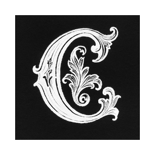

# Context

  

**Never lose context.**

Have you noticed how LLMs are so smart on the first answer and so stupid after a few back and forth? We keep them smart by intelligently managing what stays in **context**.

## Download

  

Get the latest version of Context from our GitHub releases page.

## Documentation

For setup instructions, architecture details, and development guides, see the [documentation](https://tartavull.github.io/context/).

## License

This project is licensed under the MIT License. 