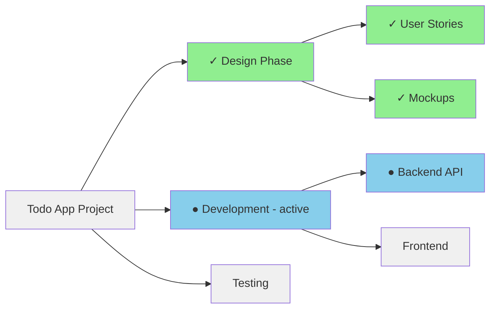
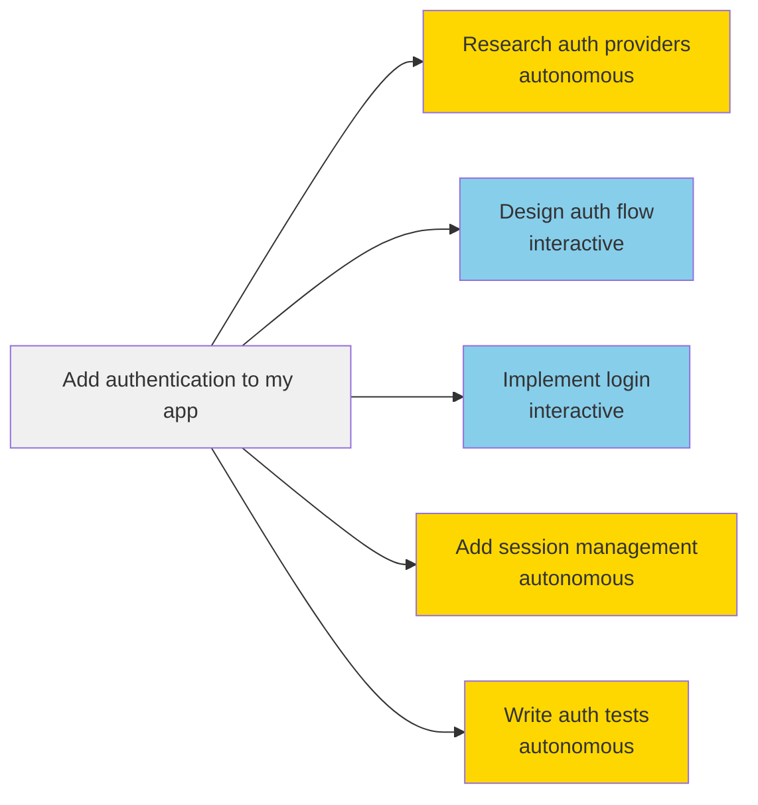

# Context: Recursive Task Decomposition for Optimal LLM Performance

## The Problem: LLMs Get Lost in Long Conversations

Recent research from Microsoft reveals a critical limitation in Large Language Models:

- **39% Performance Drop**: All LLMs exhibit significantly worse performance in multi-turn conversations compared to single-turn interactions
- **Self-Poisoning Context**: Once an LLM makes an incorrect assumption, it rarely recovers, generating overly verbose responses that compound errors
- **Universal Problem**: This affects all models equally - GPT-4, Claude, Gemini, and open-source alternatives

> *"When LLMs take a wrong turn in a conversation, they get lost and do not recover."* - Microsoft Research, 2025

## The Solution: Keep Conversations Short and Focused

Context is a conversation router that recursively decomposes complex tasks into minimal sub-tasks, solving each in isolation with optimal performance. Instead of fighting the multi-turn degradation problem, we architect around it by keeping each LLM interaction within its optimal performance zone. Never lose context.

## How It Works

### The Simplest Version: A Chat That Creates Chats

1. You describe what you want: *"Build a todo app"*
2. Instead of one long conversation, the AI creates separate, focused chats:
   - Design the UI
   - Set up the database  
   - Implement the frontend
   - Write tests
3. Each chat maintains its own context, preventing pollution and confusion

### Visual Task Tree

Click any node to jump into that conversation. See what's done, what's active, and what's pending at a glance.

## Key Features

### 1. Smart Task Decomposition
The system automatically decides when to split vs. execute tasks:

### 2. Hybrid Execution Modes
- **Interactive Tasks**: You participate and guide the conversation (e.g., design decisions, complex logic)
- **Autonomous Tasks**: Run automatically without intervention (e.g., boilerplate generation, testing)
- **Hybrid Tasks**: Start automatically but can request your input when needed

### 3. Context Isolation
- Each task maintains minimal, focused context
- No information bleed between tasks
- Parent tasks can access child results
- Sibling tasks remain independent

### 4. Continuous Prompt Improvement
- Track success rates for each prompt template
- Identify "flaky" prompts with inconsistent results
- Built-in prompt workshop for iterative refinement
- Version control for prompt evolution

## Key Benefits

- **Optimal Performance**: Maintains conversations within the reliable single-turn performance zone
- **Parallel Progress**: Multiple tasks advance simultaneously
- **Transparency**: Full visibility into task decomposition and execution
- **User Control**: Jump in exactly where your expertise is needed
- **Continuous Learning**: System improves through usage patterns

## Related Projects and Research

Several projects and research papers explore similar approaches to recursive task decomposition and multi-agent collaboration:

### Academic Research

1. **TDAG (Task Decomposition and Agent Generation)** - A framework that dynamically decomposes complex tasks into subtasks and assigns each to a specifically generated subagent. Shows 40% performance improvement over single-turn conversations.

2. **CoThinker** - Based on Cognitive Load Theory, distributes intrinsic cognitive load through agent specialization and manages transactional load via structured communication.

3. **Task Memory Engine (TME)** - Implements spatial memory frameworks with graph-based structures instead of linear context. Eliminates 100% of hallucinations in certain tasks.

4. **TalkHier (Talk Structurally, Act Hierarchically)** - Introduces structured communication protocols for context-rich exchanges and hierarchical refinement systems.

5. **Agentic Neural Networks (ANN)** - Conceptualizes multi-agent collaboration as a layered neural network architecture with forward/backward phase optimization.

### Open Source Projects

1. **Task Tree Agent** - LLM-powered autonomous agent with hierarchical task management by SuperpoweredAI. Uses dynamic tree structures for organizing tasks.

2. **AutoGPT & BabyAGI** - Early pioneering projects in autonomous agents that break down tasks and maintain task lists, though less focused on hierarchical decomposition.

3. **CrewAI** - Framework for orchestrating role-playing autonomous AI agents working together on complex tasks.

4. **LangChain Agents** - Provides tools for building agents with memory, planning, and tool integration capabilities.

### Key Differentiators of Context

While these projects share similar insights about task decomposition, Context distinguishes itself through:

- **Explicit focus on context degradation** - Built specifically to address the 39% performance drop in multi-turn conversations
- **Interactive/Autonomous hybrid execution** - Allows selective user intervention at the task level
- **Native macOS integration** - Optimized for the macOS ecosystem with system-level features
- **Visual task tree interface** - Real-time visualization and navigation of the decomposition hierarchy